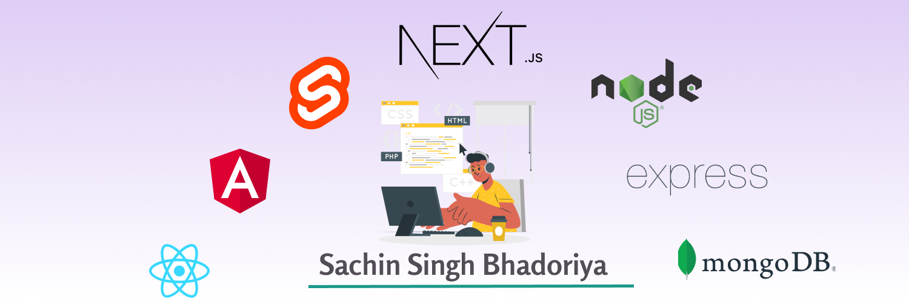

under construction ......

# Greetings My Friends

 <h3>  I am happy you stopped by to my Git Cave and I hope you enjoy my work.</h3>

 
  
 
***

## <U>Who am I? </U>

### I am a Software  Developer, well that was quick.
 

### To go in detail, I am a Software Developer, well versed in the realm of Full-Stack Web development. microelectronics and edge computation, Deep/Machine Learning, Image Processing, Android Development (Native and Cross-Platform), Database management and Version Control. I have been in several national and international hackathons and competitions hosted by various organizations and have achieved tons of remarkable feet regarding the scale of projects and recognition. 

 

### But to read more about me, you can visit my website [here](https://version0chiro.github.io/react-portfolio). 

 

***
 

### 

